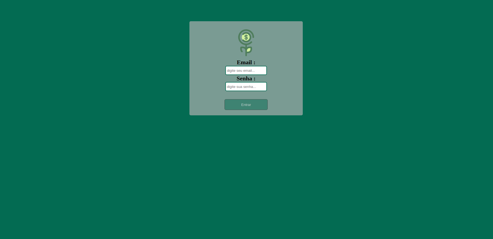
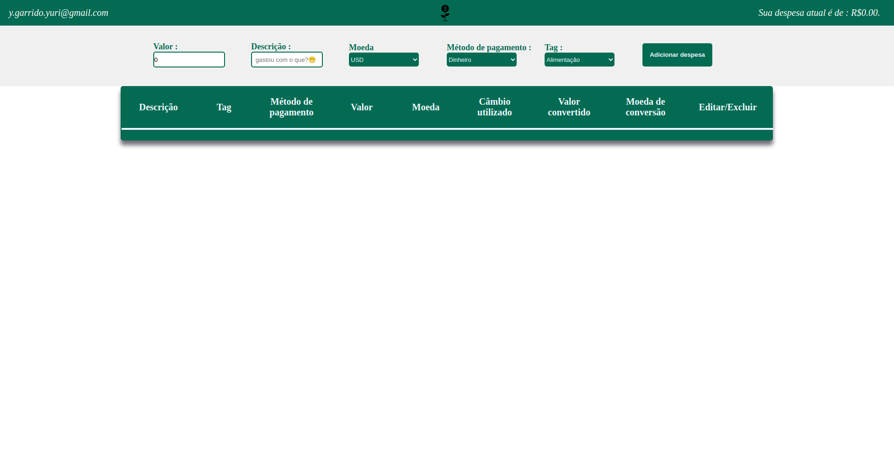
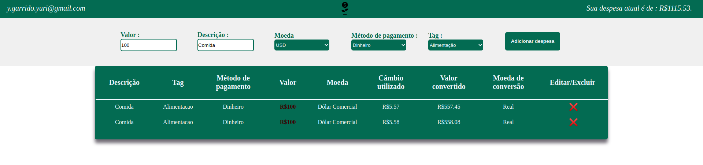
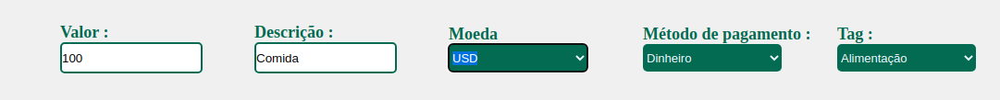
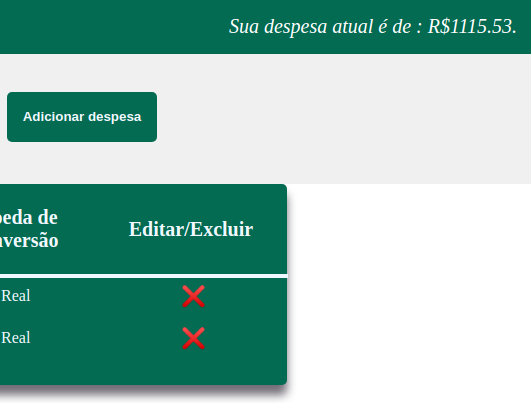

# Boas vindas ao repositório do projeto Wallet!

# Habilidades
Neste projeto, praticamos:

  * Criar um store Redux em aplicações React

  * Criar reducers no Redux em aplicações React

  * Criar actions no Redux em aplicações React

  * Criar dispatchers no Redux em aplicações React

  * Conectar Redux aos componentes React

  * Criar actions assíncronas na sua aplicação React que faz uso de Redux.

---


## O que deverá ser desenvolvido

Neste projeto vamos desenvolver uma carteira de controle de gastos com conversor de moedas, ao utilizar essa aplicação um usuário deverá ser capaz de:
  - Adicionar, remover e editar um gasto;
  - Visualizar uma tabelas com seus gastos;
  - Visualizar o total de gastos convertidos para uma moeda de escolha;

## Desenvolvimento

A aplicação usará Redux como ferramenta de manipulação de estado.

Através dessa aplicação, será possível realizar as operações básicas de criação e manipulação de um estado de redux.

## Caso queira contribuir:

1. Clone o repositório
  * Entre na pasta do repositório que você acabou de clonar
    

2. Instale as dependências e inicialize o projeto
  * Instale as dependências:
    * `npm install`
  * Inicialize o projeto:
    * `npm start` 
  * Verifique que os testes estão executando:
    * `npm test` 

3. Crie uma branch a partir da branch `main`

  * Verifique que você está na branch `main`
    * Exemplo: `git branch`
  * Se não estiver, mude para a branch `main`
    * Exemplo: `git checkout master`
  * Agora, crie uma branch onde você vai guardar os commits do seu projeto
---

## Durante o desenvolvimento

* Faça `commits` das alterações que você fizer no código regularmente

* Lembre-se de sempre após um (ou alguns) `commits` atualizar o repositório remoto

* Os comandos que você utilizará com mais frequência são:
  1. `git status` _(para verificar o que está em vermelho - fora do stage - e o que está em verde - no stage)_
  2. `git add` _(para adicionar arquivos ao stage do Git)_
  3. `git commit` _(para criar um commit com os arquivos que estão no stage do Git)_
  4. `git push -u nome-da-branch` _(para enviar o commit para o repositório remoto na primeira vez que fizer o `push` de uma nova branch)_
  5. `git push` _(para enviar o commit para o repositório remoto após o passo anterior)_

---

## Depois de terminar o desenvolvimento (opcional)

Para **"entregar"** seu projeto, siga os passos a seguir:

* Vá até a página **DO SEU** _Pull Request_, adicione a label de _"code-review"_ e marque seus colegas
  * No menu à direita, clique no _link_ **"Labels"** e escolha a _label_ **code-review**
  * No menu à direita, clique no _link_ **"Assignees"** e escolha **o seu usuário**

---


## Linter

Para garantir a qualidade do código, vamos utilizar neste projeto o linter ESLint. Assim o código estará alinhado com as boas práticas de desenvolvimento, sendo mais legível e de fácil manutenção! Para rodar o *linter* localmente no projeto, execute o comando abaixo: 

`npm run lint`


---

## Configurando o Redux DevTools
Pra usarmos o Redux DevTools com o Redux-Thunk, vamos utilizar uma biblioteca chamada `composeWithDevTools`, ela já está no package.json, a única coisa que você vai precisar fazer é configurar a sua store, por exemplo:

```
import { createStore, applyMiddleware } from 'redux';
import { composeWithDevTools } from 'redux-devtools-extension';
import thunk from 'redux-thunk';
import reducer from '../reducers';

const store = createStore(
  reducer,
  composeWithDevTools(
    applyMiddleware(thunk),
  ),
);

export default store;
```

---

## Documentação da API de Cotações de Moedas

Sua página _web_ irá consumir os dados da API do _awesomeapi API de Cotações_ para realizar a busca de câmbio de moedas. Para realizar essas buscas, vocês precisarão consultar o seguinte _endpoint_:

- https://economia.awesomeapi.com.br/json/all

O retorno desse endpoint será algo no formato:
```
{
   {
     "USD": {
       "code":"USD",
       "codein":"BRL",
       "name":"Dólar Comercial",
       "high":"5.6689",
       "low":"5.6071",
       "varBid":"-0.0166",
       "pctChange":"-0.29",
       "bid":"5.6173",
       "ask":"5.6183",
       "timestamp":"1601476370",
       "create_date":"2020-09-30 11:32:53"
       },
      ...
   }
}
```

Se você quiser aprender mais informações sobre a API, veja a [documentação](https://docs.awesomeapi.com.br/api-de-moedas).

---

## Execução de testes unitários

Vamos utilizar [React Testing Library](https://testing-library.com/docs/react-testing-library/intro) para execução dos testes unitários.

Esse _framework_ de testes utiliza algumas marcações no código para verificar a solução proposta, uma dessas marcações é o atributo `data-testid` e faremos uso dele aqui.

Na descrição dos requisitos (logo abaixo) será pedido que seja feita a adição de atributos `data-testid` nos elementos _HTML_. Vamos a um exemplo para deixar claro essa configuração:

Se o requisito pedir "crie um botão e adicione o id de teste (ou `data-testid`) com o valor `my-action`, você pode criar:

```html
<button data-testid="my-action"></button>
```

ou

```html
<a data-testid="my-action"><a/>
```

ou seja, o atributo `data-testid="my-action"` servirá para o React Testing Library(RTL) identificar o elemento e dessa forma, conseguiremos realizar testes unitários focados no comportamento da aplicação.

Em alguns requisitos, utilizamos o `getByRole` para poder selecionar os elementos de forma semântica. Portanto atente-se às instruções de cada requisito. Por exemplo, se o requisito pedir explicitamente um `button`, você deverá utilizar exatamente esse elemento.

Afim de verificar a solução proposta, você pode executar todos os testes unitários localmente, basta executar:

```bash
npm test
```

### Dica: desativando testes

Para rodar apenas um teste, basta a utilização da função `.only` após o describe. Com isso, será possível que apenas um requisito rode localmente e seja avaliado.


Caso queira avaliar apenas um tópico do requisito, você também pode usar o `.only` após o `test`.


---

# Sobre a aplicação:

<br />

### Assim que entramos na aplicação nos deparamos com a seguinte página de login

- Essa pagina verifica se o campo de email contem '@email.com'
- verifica se a senha possui pelo menos 6 caracteres.
- se o email e senha estiverem preenchidos da maneira correta, o botão é abilitado.
<br />

<br />
<br />

### Aqui podemos ver a aplicação após preencher o login

<br />

<br />
<br />

### Agora, podemos ver como fica a aplicação após adicionar algumas despezas.

<br />

<br />
<br />

### Nessa imagem, podemos ver os imputs, que estão disponíveis na aplicação

<br />

<br />
<br />

### Agora, com uma ênfase no valor final, podemos observar mais um dos funcionamentos da aplicação, podendo dessa forma informar o usuário de uma maneira simples.

<br />

